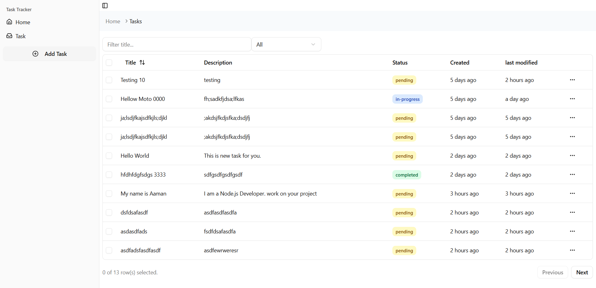

# ✅ Task Tracker App (Full-Stack)

A full-stack **Task Tracker application** built with:  
- **Frontend** → React + Vite + TypeScript + TailwindCSS (MVVM architecture)  
- **Backend** → Node.js + Express + MongoDB (MVC architecture)  

This app allows users to **create, update, complete, and filter tasks** with a clean separation of concerns in both frontend and backend.

---

## 📂 Project Structure
```bash
task-tracker/
├── client/ # Frontend (MVVM - React + Vite + TailwindCSS)
│ └── README.md
├── server/ # Backend (MVC - Node.js + Express + MongoDB)
│ └── README.md
└── README.md # Root project overview
```


---

## 🖼️ Screenshots
### Frontend



---

## 🚀 Features
- **Frontend (MVVM)**
  - Task creation, update, and deletion
  - Responsive UI with TailwindCSS
  - Toast notifications
  - Clear separation: Model / View / ViewModel
- **Backend (MVC)**
  - RESTful API with CRUD operations
  - MongoDB storage with Mongoose models
  - Error handling middleware
  - Service layer for business logic

---

## ⚙️ Tech Stack
- **Frontend**: React 19, Vite, TypeScript, TailwindCSS, Radix UI, Lucide Icons, Axios, React Router v7  
- **Backend**: Node.js, Express.js, MongoDB, Mongoose, Nodemon  
- **Common Tools**: ESLint, TypeScript ESLint, Prettier  

---

## 📦 Installation & Setup

### 1️⃣ Clone the repository
```bash
git clone https://github.com/yourusername/task-tracker.git
cd task-tracker
```
### 2️⃣ Setup Backend (Server)
```bash
cd server
npm install
npm run dev
```
Backend runs at 👉 http://localhost:8000/api/tasks
### 3️⃣ Setup Frontend (Client)
```bash
cd client
pnpm install
pnpm dev
```
Frontend runs at 👉 http://localhost:5173

## 🔗 API Endpoints (Backend)
| Method | Endpoint        | Description         |
| ------ | --------------- | ------------------- |
| GET    | /api/tasks      | Get all tasks       |
| GET    | /api/tasks/\:id | Get task by ID      |
| POST   | /api/tasks      | Create a new task   |
| PUT    | /api/tasks/\:id | Update a task by ID |
| DELETE | /api/tasks/\:id | Delete a task by ID |

---
## 🛠️ Future Improvements
- Add user authentication (JWT)
- Task due dates & reminders
- Pagination & filtering
- Unit & integration testing

## 👨‍💻 Author
<h3 align="center">Aaman Sayyed</h3> <p align="center"> <a href="https://sayyedaaman.vercel.app/">  </a> <a href="https://www.linkedin.com/in/sayyed-aaman/">  </a> <a href="https://github.com/sayyedaaman2">  </a> <a href="mailto:sayyedaaman9@gmail.com">  </a> </p> 