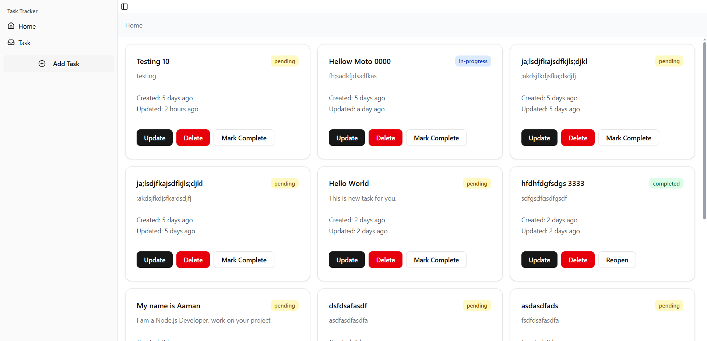
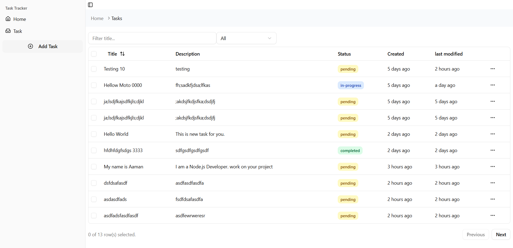

# 🎨 Task Tracker App - Frontend (MVVM Architecture)

A simple **Task Tracker Frontend** built with **React + Vite + TypeScript + TailwindCSS**, following the **MVVM (Model-View-ViewModel)** architecture pattern. This client consumes the backend API and provides a clean, responsive user interface for managing tasks.


---


---

## 🚀 Features
- User-friendly task management interface
- Add, update, and delete tasks via backend API
- Filter tasks by status (e.g., pending, completed)
- Responsive UI with TailwindCSS
- Toast notifications for feedback
- Clean separation of concerns with MVVM pattern

---

## 📂 Folder Structure
```bash
src/
├── models/        # Data models (Task, User, DTOs)
│   └── taskModel.ts
├── views/         # UI (pages, layouts, screens)
│   └── TaskListView.tsx
├── viewmodels/    # State + logic binding Models to Views
│   └── taskViewModel.ts
├── components/    # Reusable UI components (Button, Modal, etc.)
│   └── TaskCard.tsx
├── utils/         # Helper functions, constants
│   └── apiClient.ts
├── assets/        # Images, fonts, icons
├── hooks/         # Custom hooks if any
├── index.css        # Tailwind / global css
├── main.tsx       # App entry point
└── App.tsx        # Root component with routing
```
---

## 🏗️ Architecture (MVVM)
- **Model (M)** → Defines data structures and API response models (e.g., Task model).
- **View (V)** → UI components, pages, and layouts (React components).
- **ViewModel (VM)** → Connects Views with Models, manages state and business logic (e.g., calls APIs, transforms data, exposes observables/state for Views to consume).

Example responsibilities:
- `models/` — TypeScript interfaces and types (Task, TaskDTO).
- `viewmodels/` — business logic, state, API calls (using Axios), and exposes functions/props to Views.
- `views/` — presentational components that consume ViewModel outputs and call ViewModel actions.
- `components/` — small reusable UI pieces (Button, Modal, FormInput, TaskCard).

---

## ⚙️ Tech Stack
- **React 19** – UI framework
- **Vite** – Build tool
- **TypeScript** – Static typing
- **TailwindCSS** – Styling
- **Radix UI + lucide-react** – Accessible UI components & icons
- **Axios** – API requests
- **React Router v7** – Client-side routing
- **Moment.js** – Date handling
- **ESLint + TypeScript ESLint** – Code linting

---

## 📦 Installation & Setup

1. Clone the repo:
    git clone https://github.com/yourusername/task-tracker-app-client.git
    cd task-tracker-app-client

2. Install dependencies:
    pnpm install
  
3. Run development server:
    pnpm dev

App will start at:
👉 http://localhost:5173

4. Build for production:
    pnpm build

5. Preview production build:
    pnpm preview

6. Lint code:
    pnpm lint

---

## 🔗 API Integration
The frontend consumes the **Task Tracker Backend API**. Make sure the backend server is running before starting the client.

Example:
    const response = await axios.get("http://localhost:8000/api/tasks");

Base URL can be configured via environment (e.g. `.env`):
    VITE_API_BASE_URL=http://localhost:8000

---

## 🖼️ Example UI Components / Pages
- **TaskListView** — shows list of tasks, filters, and actions.
- **TaskCard** — displays single task with edit/delete buttons.
- **AddTaskModal** — form to create a new task.
- **EditTaskForm** — edit task details.
- **Layout** — header, navigation, and container for views.

---

## 📚 Best Practices & Guidelines
- Keep **ViewModels** responsible for side effects (API calls), transformation, and state shape.
- Keep **Views** purely presentational: receive state & callbacks from ViewModels.
- Keep **Models** as single source of types/interfaces.
- Use TypeScript strictly (noImplicitAny, strict mode recommended).
- Use ESLint + Prettier to maintain consistent code style.
- Prefer functional components and React hooks.
- Keep components small and focused — one responsibility each.

---

## 🛠️ Future Improvements
- Add user authentication (JWT)
- Add task due dates & reminders
- Add pagination and advanced filtering
- Add unit/integration tests (Jest + React Testing Library)
- Implement dark mode and accessibility improvements
- Use a state library (Zustand / Redux) if app state grows

---

## 📜 License
This project is private. All rights reserved.

---

## 👨‍💻 Author

<h3 align="center">Aaman Sayyed</h3>

<p align="center">
  <a href="https://sayyedaaman.vercel.app/">
    
  </a>
  <a href="https://www.linkedin.com/in/sayyed-aaman/">
    
  </a>
  <a href="https://github.com/sayyedaaman2">
    
  </a>
  <a href="mailto:sayyedaaman9@gmail.com">
    
  </a>
</p>
